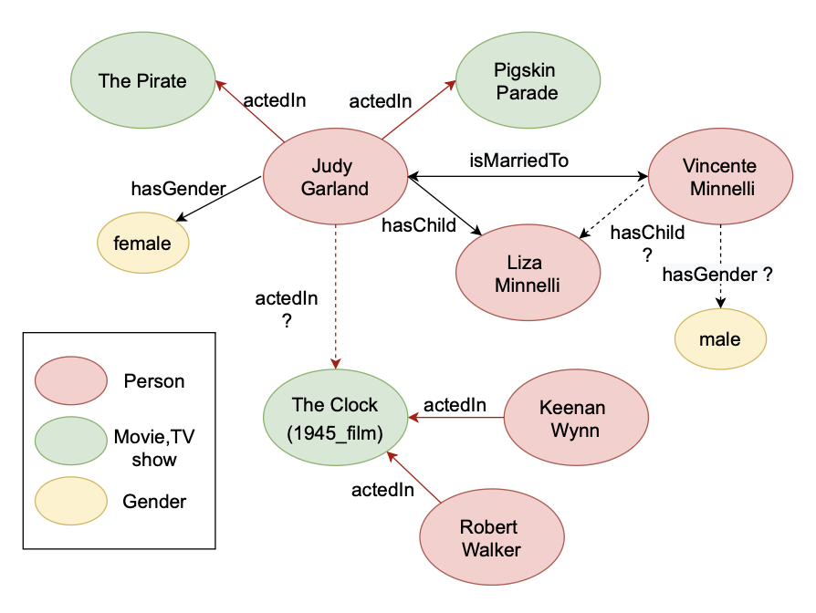
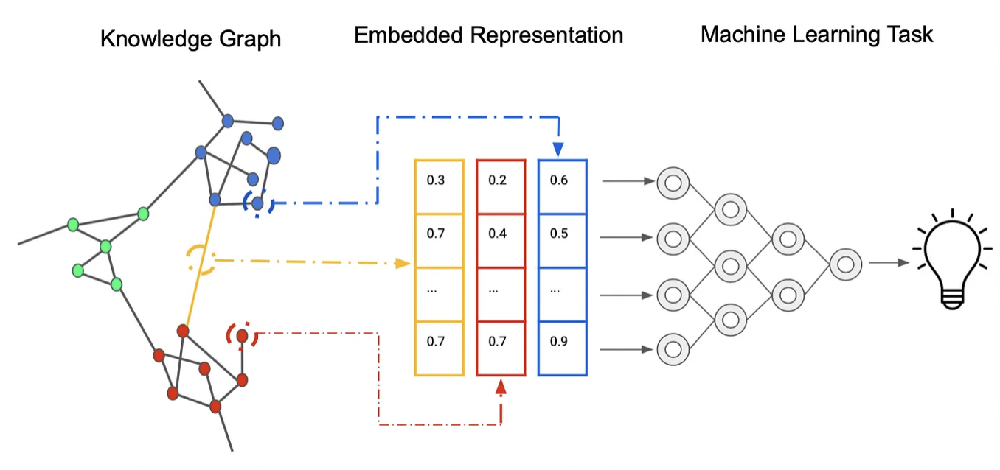

# 第八章 GNN应用

## 8.1 GNN在知识图谱中的应用

图神经网络（GNN）是一种强大的机器学习模型，特别适合处理具有复杂结构的数据，如知识图谱。知识图谱和语义网络一样，都是以结构化方式表示知识的方法。

     
     
    
图8-1. 数据集YAGO3-10的部分

在知识图谱上，GNN可以应用于以下方面：

- 知识表示学习：知识图谱中的每个实体和关系都可以被视为图中的一个节点和一条边。GNN可以通过学习这些节点和边的特征，将知识图谱转化为一种更易于计算机理解的形式。
- 链接预测：知识图谱的链接预测问题可以转化为图上的链接预测问题。GNN可以通过学习图中节点和边的特征，预测两个节点之间是否存在一条边，或者预测一条边的属性。
- 知识推理：知识推理是知识图谱的重要应用之一。GNN可以通过学习图的结构和特征，从已知的知识推出新的知识。例如，通过已知“鸟会飞”和“鸽子是鸟”，我们可以推断出“鸽子会飞”。
- 问答系统：在问答系统中，GNN可以用于问答的生成和检索。例如，对于一个问题“什么是人工智能？”，GNN可以生成一个答案“人工智能是一种模拟人类智能的技术”。

     
     
    
图8-2. 用图神经网络处理知识图谱的流程

总之，GNN在知识图谱上的应用非常广泛，可以为知识图谱的构建、维护和使用提供强有力的支持。下面我们列举一些基于图神经网络做知识图谱补全任务的工作。

- 在[IJCAI2017](https://arxiv.org/abs/1706.05674)中，讨论 KBC(Knowledge Base Completion) 中的知识库外实体（OOKB）问题，即如何回答与训练时未观察到的测试实体有关的查询。为了在不重新训练的情况下解决 OOKB，他们利用图神经网络 (GNN) 计算 OOKB 实体的嵌入，同时利用测试时提供的有限辅助知识。

- 在[ESWC2018](https://arxiv.org/abs/1703.06103)介绍了关系图卷积网络（R-GCN），并将其应用于两个标准的知识库补全任务： 链接预测（恢复缺失的事实，即主题-预测-对象三元组）和实体分类（恢复缺失的实体属性）。

- 在[ICLR2020](https://arxiv.org/abs/1909.11334)提出了用于大规模知识图推理的动态剪枝信息传递网络（DPMPN）。

- 在[ICML2020](https://arxiv.org/abs/1911.06962)提出了一种基于图神经网络的关系预测框架--GraIL，它可以对局部子图结构进行推理，并具有很强的归纳偏向，以学习与实体无关的关系语义。

- 在[ICLR2020](https://arxiv.org/abs/2001.11850)探索了 MLN(Markov Logic Networks) 与 GNN 的结合，并在 MLN 中使用图神经网络进行变分推理。我们提出了一种名为 ExpressGNN 的 GNN 变体，它在模型的表示能力和简单性之间取得了很好的平衡。

- 在[NeurIPS2021](https://arxiv.org/pdf/2106.06935)提出了神经Bellman-Ford网络(Neural Bellman-Ford Network, NBFNet)，这是一种通用的图神经网络框架，它使用广义Bellman-Ford算法中的学习算子来解决路径制定问题。NBFNet涵盖了许多传统的基于路径的方法，可以应用于同质图和多关系图(例如，知识图谱)的转换和归纳。在同质图和知识图谱上的实验表明，所提出的NBFNet大大优于现有方法。

